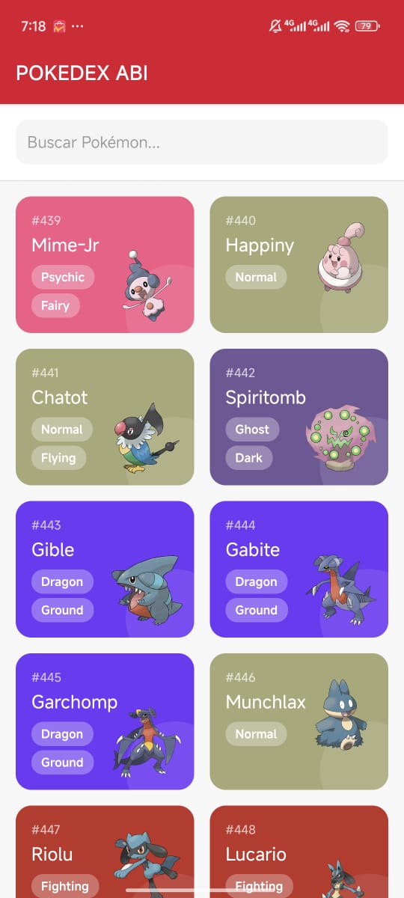
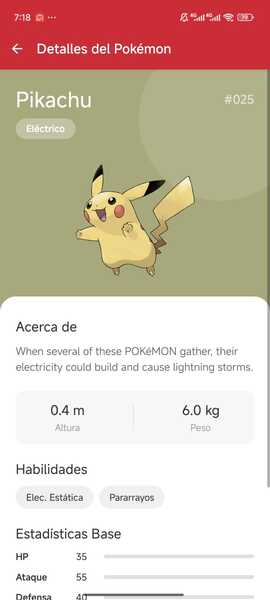

# Pokedex - App de Consulta de Pokemon

## 1. Identificación del Proyecto

- **Nombre de la App:** Pokedex  
- **Asignatura/Profesor:** Desarrollo de Aplicaciones Móviles / Abisai Geronimo Ortiz  
- **Periodo/Fecha:** Septiembre 2025  
- **URL del Repositorio:** [https://github.com/Abisaigeronimo/Pokedex-Suprema-App.git](https://github.com/Abisaigeronimo/Pokedex-Suprema-App.git)  

## 2. Descripción del Proyecto

Pokedex es una aplicación móvil desarrollada con React Native y Expo para explorar información básica de Pokémon usando datos de ejemplo y estructura lista para conectar con la PokéAPI. Presenta una interfaz moderna enfocada en facilidad de uso y diseño responsivo.

### Características Principales:
- 📱 Lista de Pokémon: Visualización tipo grid de varios Pokémon.  
- 🔍 Búsqueda Rápida: Filtrado instantáneo por nombre.  
- 🎨 Interfaz Moderna: Tema oscuro y componentes estilizados.  
- 🧭 Navegación Intuitiva: Navegación stack, transiciones fluidas.  
- 🧪 Datos Ejemplo: Bulbasaur, Charmander, Squirtle, Pikachu precargados.  

### Funcionalidades Implementadas:
- Búsqueda y listado de Pokémon en tarjetas.  
- Pantalla de detalles con imagen, nombre, altura y peso.  
- Navegación entre pantallas (lista ⇄ detalles).  
- Interfaz responsiva, optimizada para móviles.  
- Estructura modular para fácil extensión.  

## 3. Tecnologías y Versiones Utilizadas

### Stack Tecnológico:
- React Native: 0.81.4  
- React: 19.1.0  
- Expo: ~54.0.3  
- React Navigation: v7+  
- React Native Screens: ~4.16.0  
- React Native Safe Area Context: ~5.6.0  
- TypeScript: Integración completa  

### Herramientas Requeridas:
- **Node.js:** v18.17.0 o superior
  ```bash
  node --version
  ```
- **NPM:** 9.0.0+ o Yarn v1.22.19+
  ```bash
  npm --version
  # o
  yarn --version
  ```
- **Expo CLI:** v6.3.0+
  ```bash
  npx expo --version
  ```
- **Android Studio:** v2022.3+ con Android SDK 33+ **o** Expo Go app en dispositivo físico
  ```bash
  # Verificar Android SDK
  adb --version
  ```

### Verificación de Entorno:  
```bash
npx expo doctor
```


## 4. Estructura del Proyecto
### Organización de Archivos:
```

pokedex-abi/
├── App.tsx # Componente raíz de la app
├── package.json # Dependencias y scripts
├── tsconfig.json # Configuración TypeScript
├── assets/ # Iconos e imágenes
├── screens/ # Pantallas principales
  ├── HomeScreen.tsx
  └── PokemonDetailScreen.tsx
├── components/ # (Preparado para componentes reutilizables)
├── constants/ # Colores, etiquetas, configuración API
├── services/ # (Preparado para llamadas a pokeapi)
├── types/ # Interfaces y tipos TS para Pokémon
├── hooks/ # (Futuros hooks personalizados)
└── utils/ # (Constantes y utilidades)
```


### Arquitectura:
- **App.tsx**: Enrutador central tipo Stack  
- **HomeScreen**.tsx: Lista principal y filtrado  
- **PokemonDetailScreen**.tsx: Detalles individuales  
- **constants/colors.ts**: Paleta temática y colores por tipo  
- **types/pokemon.types.ts**: Interfaces y modelos usados en la app  

## 5. Instalación y Configuración

### Instalación de Dependencias:
```bash
# Clonar el repositorio
git clone https://github.com/Abisaigeronimo/Pokedex-Suprema-App.git
cd pokedex-app


# Instalar dependencias
npm install
```

### Dependencias Esenciales:

| Dependencia                    | Versión   | Propósito                          |
|-------------------------------|-----------|----------------------------------|
| @react-navigation/native      | ^7.x      | Core de navegación                |
| @react-navigation/native-stack| ^7.x      | Navegación tipo stack             |
| react-native-screens          | ~4.16.0   | Mejorar transiciones nativas      |
| react-native-safe-area-context| ~5.6.0    | Zonas seguras de pantalla         |
| expo                         | ~54.0.3   | Framework react nativo multiplataforma |
| react                       | 19.1.0    | Biblioteca de UI                  |
| react-native                 | 0.81.4    | React Native core                 |

### Verificar instalación:
```bash
npm list --depth=0
```

## 6. Ejecución de la Aplicación

### Scripts Disponibles:
```bash
# Iniciar servidor de desarrollo
npm start
# o
npx expo start

# Ejecutar en Android (emulador/dispositivo)
npm run android
# o
npx expo start --android

# Ejecutar en iOS (solo macOS)
npm run ios
# o  
npx expo start --ios

# Ejecutar en web
npm run web
# o
npx expo start --web
```

### Primera Ejecución:
1. **Instalar dependencias:**
   ```bash
   npm install
   ```

2. **Iniciar el servidor de desarrollo:**
   ```bash
   npm start
   ```

3. **Conectar dispositivo:**
   - **Android:** Usar Expo Go o emulador
   - **iOS:** Usar Expo Go o simulador
   - **Web:** Se abrirá automáticamente en el navegador

### Notas de Entorno:
- **Emulador Android:** Debe estar iniciado antes de ejecutar `npm run android`
- **Dispositivo físico:** Usar Expo Go y escanear QR code
- **Túnel para redes restrictivas:** `npx expo start --tunnel`.  

## 7. Funcionalidades de la Aplicación

### Pantalla Principal (HomeScreen):



- Grid de Pokémon: Muestra cuatro Pokémon.  
- Búsqueda: Filtra por nombre en tiempo real.  
- Diseño: Tarjetas coloridas por tipo.  

### Pantalla de Detalles (PokemonDetailScreen)



- Datos mostrados: Imagen, nombre, tipos, altura y peso.  
- Navegación fácil: Botón “regresar” a la lista.  
- Preparada para expandirse con habilidades, estadísticas, etc.  

### Pokémon de ejemplo:
- Bulbasaur  
- Charmander  
- Squirtle  
- Pikachu  

## 8. Desarrollo y Extensión

### Siguientes mejoras sugeridas:
- Conexión real a PokéAPI para obtener datos reales.  
- Favoritos persistentes (AsyncStorage).  
- Filtro y búsqueda avanzada.  
- Pantalla por categorías (tipos).  
- Detalles avanzados y más información.  
- Soporte offline (future).  
- Integración de imágenes locales/remotas.  

### Estructura básica para crear pantallas nuevas (TypeScript):
```typescript

export function NewScreen() {
return (
<View style={{ flex: 1 }}>
{/* Contenido aquí */}
</View>
);
}
```


## 9. Troubleshooting

| Problema                | Solución                        |
|------------------------|--------------------------------|
| Error instalación       | npm install --legacy-peer-deps |
| Cache de Metro corrupto | npx expo start --clear         |
| Puerto ocupado          | npx expo start --port 8082     |
| WiFi/Conexión lenta     | npx expo start --tunnel        |

### Comandos útiles:
```bash
npx expo doctor
npx expo start --clear
rm -rf node_modules package-lock.json && npm install
```


## 10. Recursos y Documentación

- [Expo Documentation](https://docs.expo.dev/)  
- [React Navigation](https://reactnavigation.org/)  
- [React Native Docs](https://reactnative.dev/)  
- [PokéAPI](https://pokeapi.co/)  

---

**Desarrollado por:** Abisai Geronimo Ortiz  
**Última actualización:** 8 de octubre 2025  
**Versión:** 0.1.0  
